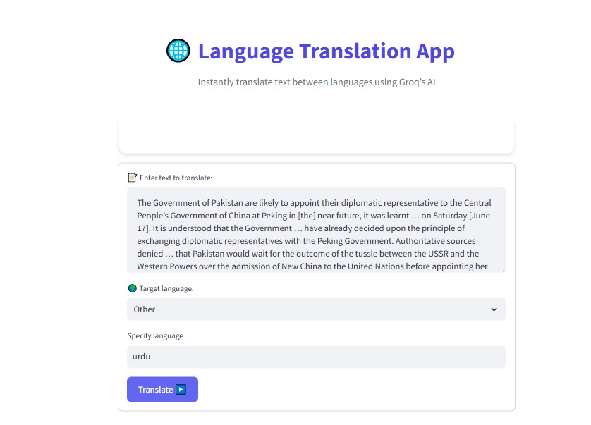

# 🌐 Language Translation App

An interactive Streamlit application that lets you instantly translate text between languages using Groq’s vision-capable LLM.  

---

## 🚀 Features

- **Rich, card-based UI** with custom styling  
- **Form-based input** for source text and target language  
- **Predefined language list** (plus “Other”) with dynamic input  
- **Live “Translating…” spinner** and success feedback  
- **Downloadable translation** as a UTF-8 text file  

---



## 🛠 Tech Stack

- **Python 3.8+**  
- **Streamlit** for the frontend UI  
- **Groq Chat API** (`gemma2-9b-it` model) for translation  
- **Custom CSS** injected for branding and polished look  

---

## 📦 Installation

1. **Clone the repository**  
   ```bash
   git clone https://github.com/Noor-Fatima-Afzal/Language-Translator.git
   cd Language-Translator
